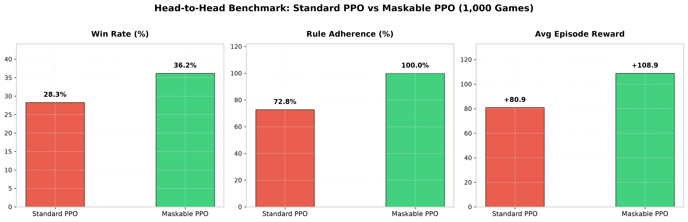
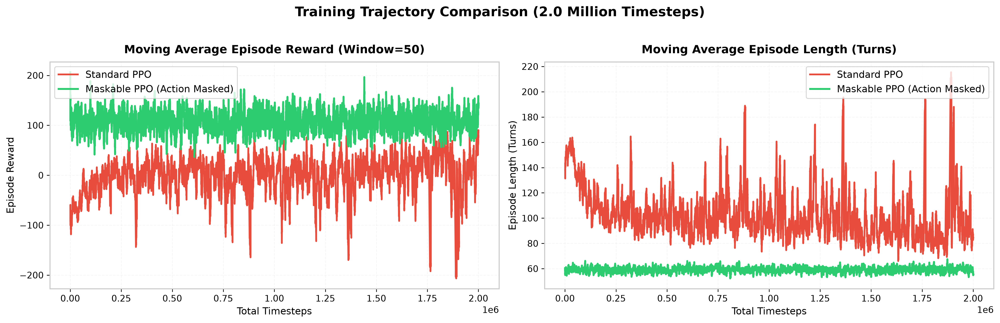

# Computational Formalization and Reinforcement Learning Baselines for Assamese Traditional Games: A Case Study on Kori Khel

**Target Venue:** IndoML 2026 (7th Indian Symposium on Machine Learning) — Undergraduate Forum  
**Venue & Date:** IIT Kharagpur Kolkata Extension Centre / Research Park | December 18–20, 2026  
**Authors:** Dipjyoti Das, Simanta Sharma, Rupam Bhattacharyya (Advisor)  
**Affiliation:** Department of Information Technology, Gauhati University, Assam, India

---

## Abstract

Reinforcement Learning (RL) benchmark environments have focused primarily on standardized Western board and video games. Consequently, indigenous multi-agent board games featuring asymmetric stochastic dynamics and complex topological constraints remain largely unmodeled in standard RL benchmark suites. In this paper, we present a computational formalization and Gymnasium environment for **Kori Khel**, a traditional 4-player stochastic cowrie-shell board game native to Assam, India. We abstract the physical 2D cross-shaped board into a 73-state 1D Markov Decision Process (MDP) per player, incorporating asymmetric binomial dice distributions, 8 safe zones, and capture mechanics. We evaluate policy gradient baselines using Proximal Policy Optimization (PPO) under two regimes: standard reward-penalty shaping (1M timesteps) and invalid action masking (2M timesteps). Across a 1,000-game evaluation benchmark, Standard PPO fails to maintain legal play (72.8% rule adherence, 28.30% win rate) due to severe entry-state bottlenecks. In contrast, Maskable PPO achieves 100% rule adherence, an average episode reward of +108.90, and a **36.20% win rate** against rule-compliant opponents in a 4-player setting (outperforming the 25.0% random baseline). We analyze the mathematical necessity of action masking in stochastic games with hard entry constraints and outline directions toward formalizing broader suites of regional games.

---

## 1. Introduction

**Kori Khel** is a 4-player cowrie-shell race game played across rural Assam, India. Structurally resembling Pachisi and Ludo, it is characterized by a highly skewed binomial dice distribution and a strict entry constraint: tokens remain trapped off-board ($s=0$) until an exact roll (_Jagowa_) is obtained. This entry rule induces a bottlenecked action space where reward-penalty shaping fails to guide unmasked policy gradient methods, rendering Kori Khel a compelling domain for evaluating invalid action masking techniques.

While RL benchmark suites encompass Chess, Go, and StarCraft II, regional Indian games lack standardized computational state-space definitions. This work addresses this gap through the following contributions:

1. A formal state-space specification of Kori Khel, mapping its physical 2D cross grid into a 73-state 1D coordinate system.
2. An open-source OpenAI Gymnasium environment (`KoriKhelEnv`).
3. A comparative empirical benchmark evaluating Standard PPO versus Maskable PPO under stochastic dice conditions.

---

## 2. Kori Khel Game Formalization

### 2.1 Asymmetric Stochastic Roll Model

Kori Khel is played with 6 cowrie shells (_kori_). The outcome of a throw is defined by the number of shells landing face-down (_uburi_), modeled as a binomial variable $K \sim \text{Binomial}(6, p=0.5)$:

$$\mathbb{P}(K = k) = \binom{6}{k} (0.5)^6$$

- **Pochi ($k=5$, 1 Open, 5 Closed):** 25 steps + Bonus Turn ($\mathbb{P} \approx 9.38\%$).
- **Jagowa ($k=1$, 5 Open, 1 Closed):** 10 steps + Bonus Turn ($\mathbb{P} \approx 9.38\%$) — _Mandatory entry roll required to release tokens from Base._
- **Mudra ($k=0$, 6 Open, 0 Closed):** 12 steps + Bonus Turn ($\mathbb{P} \approx 1.56\%$).
- **Standard Throws ($k \in \{2, 3, 4, 6\}$):** 4, 3, 2, 6 steps respectively (No bonus turn).
- **3-Blow Rule:** Rolling 3 consecutive bonus turns invalidates all accumulated points for that turn.

### 2.2 Board Abstraction & MDP Mapping

The physical board consists of 4 arms arranged in a cross (➕), each with 3 columns of 8 cells. We map this 2D geometry into a **1D state sequence of 73 positions** for each player:

- **State $s = 0$ (Base):** Token is inactive off-board; requires a _Jagowa_ (10) roll to enter state $1$.
- **States $s \in [1, 64]$ (Shared Outer Perimeter):** Shared 64-cell track traversed in a strict global counter-clockwise spiral across the 4 board arms. Collisions on non-safe cells result in capture (_Khua_), returning the opponent to $0$.
- **Safe Zones ($X$ Marks):** 8 designated sanctuary cells (Row 4 outer cells on perimeter) where collisions do not trigger capture ($s \in \{5, 12, 21, 28, 37, 44, 53, 60\}$).
- **States $s \in [65, 72]$ (Private Home Corridor):** Private 8-cell central corridor leading to the center.
- **State $s = 73$ (Ghai / Goal):** Terminal winning state (_Pokoa_). First player to move all 4 tokens to 73 wins.

---

## 3. Reinforcement Learning Architecture

### 3.1 Observation & Action Spaces

- **Observation Vector $\mathbf{o} \in \mathbb{Z}^{30}$:** Concatenates raw positions and engineered tactical features: $[s_{0..3}, s^{\text{opp}}_{1..12}, r, b, \mathbf{c}_{0..3}, \mathbf{z}_{0..3}, \mathbf{d}_{0..3}]$, where $s_{0..3}$ denote active agent positions ($[0,73]$), $s^{\text{opp}}_{1..12}$ denote opponent positions across seats, $r \in [0,25]$ is the dice roll, $b \in \{0,1\}$ is the bonus turn flag, $\mathbf{c} \in \{0,1\}^4$ indicate projected captures, $\mathbf{z} \in \{0,1\}^4$ indicate safe-zone landings, and $\mathbf{d} \in [0,64]^4$ measure rear threat distances.
- **Action Space $a \in \{0, 1, 2, 3\}$:** Discrete action selecting which of the 4 agent tokens to advance.

### 3.2 Reward Design & Coefficient Justification

$$\mathcal{R}(s, a, s') = r_{\text{progress}} + r_{\text{event}}$$

- $r_{\text{progress}} = +0.1 \times (s' - s)$
- $r_{\text{capture}} = +20$ (Capturing opponent token) / $-20$ (Getting captured)
- $r_{\text{ghai}} = +30$ (Token reaching state 73)
- $r_{\text{win}} = +100$ (Winning the match) / $-100$ (Loss)
- $r_{\text{invalid}} = -2$ (Selecting an illegal move; Standard PPO only)

---

## 4. Empirical Evaluation & Baseline Results

We trained Standard PPO for **1M timesteps** and Maskable PPO for **2M timesteps** against 3 rule-compliant heuristic opponents:

1. **Standard PPO (Unmasked, 1M Steps):** Relies on penalty shaping ($r_{\text{invalid}} = -2$) to learn valid moves.
2. **Maskable PPO (Masked, 2M Steps):** Employs invalid action masking with linear learning rate decay ($3 \times 10^{-4} \to 5 \times 10^{-5}$) and tuned entropy coefficient ($\text{ent\_coef}=0.005$) to restrict policy distribution $\pi(a|s)$ exclusively to legal actions.

### 4.1 Quantitative Performance (1,000-Game Head-to-Head Benchmark)

| Metric                             | Standard PPO (1M Steps) | Maskable PPO (2M Steps, Tuned) |      Relative Advantage      |
| :--------------------------------- | :---------------------: | :----------------------------: | :--------------------------: |
| **Win Rate (%)**                   |         28.30%          |           **36.20%**           |   **+27.9% Relative Gain**   |
| **Rule Adherence Rate (%)**        |         72.80%          |          **100.00%**           | **Perfect Policy Validity**  |
| **Average Episode Length (Turns)** |       94.2 turns        |         **59.5 turns**         |  **~37% Faster Completion**  |
| **Average Episode Reward**         |       +80.93 pts        |        **+108.90 pts**         | **+34.6% Reward Efficiency** |

  
_Figure 1: Head-to-Head 1,000-Game Benchmark Comparison across Win Rate (%), Rule Adherence (%), and Average Episode Reward (pts)._

  
_Figure 2: Training Trajectory Comparison over training timesteps showing moving average reward and episode length convergence._

### 4.2 Analytical Insights

Standard PPO suffers from persistent invalid move sampling ($72.8\%$ rule adherence even after 1M steps). Because tokens at Base ($s=0$) require an exact roll of 10 to enter the board, unmasked agents repeatedly sample illegal actions, getting trapped in local penalty minima. Conversely, Maskable PPO guarantees 100% legal play from step 1, achieving a **36.20% win rate** after 2M steps that significantly outperforms the 4-player random baseline ($25.0\%$).

---

## 5. Conclusion & Future Work

This paper presented a formal MDP abstraction and Gymnasium benchmark environment for Kori Khel, proving that action masking is essential for overcoming entry-roll bottlenecks. Extending this framework to other regional games requires tailored state-space adaptations; for instance, formalizing **Dhop Khel** necessitates transitioning from our 73-state discrete single-track MDP to a continuous 2D spatial coordinate system with multi-agent ball-possession and tagging dynamics under partial observability.

---

## 6. References

1. **J. Schulman et al. (2017).** _Proximal Policy Optimization Algorithms._ arXiv:1707.06347.
2. **S. Huang & S. Ontañón (2022).** _A Closer Look at Invalid Action Masking in Policy Gradient Algorithms._ FLAIRS Conference.
3. **M. Towers et al. (2024).** _Gymnasium: A Standard Interface for Reinforcement Learning Environments._ arXiv:2407.17032.
