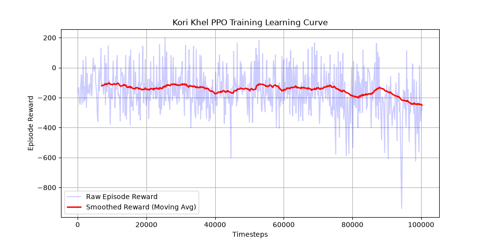

# Computational Formalization and Reinforcement Learning Baselines for Kori Khel: A Traditional Assamese Board Game

**IndoML 2026 Undergraduate Forum Submission Draft**
**Authors:** [Your Name], [Project Partners' Names]  
**Advisor:** [Advisor/Guide Name], Dibrugarh University  

---

## Abstract
Traditional cultural games are rapidly fading from public memory due to the dominance of modern digital recreation. This paper presents a systematic framework to digitally preserve and computationally formalize **Kori Khel**, a traditional cowrie-shell board game from Assam, India. We mathematically abstract the game’s 2D cross-shaped board into a 73-state 1D MDP and implement a custom Gymnasium environment. We establish baseline performance benchmarks by training a Reinforcement Learning agent using Proximal Policy Optimization (PPO) against rule-based random opponents. After an extended training run of 2,000,000 steps, the PPO agent achieved a **22.00% win rate** in a 4-player setting, with a **46.3% rule adherence rate**, highlighting critical algorithmic bottlenecks in learning complex constraints without action masking.

---

## 1. Introduction & Background
Traditional Assamese games like Kori Khel carry significant cultural heritage but lack formal mathematical documentation. In this work, we address this preservation gap by:
1. Creating a formal computational rulebook for Kori Khel.
2. Developing a Gymnasium-compliant environment suitable for Reinforcement Learning research.
3. Establishing baseline results using modern policy gradient methods (PPO).

---

## 2. Kori Khel Game Formulation
Kori Khel is played by 4 players, each managing 4 tokens. The game utilizes 6 cowrie shells as stochastic dice, where the number of shells landing face-down ($k \sim \text{Binomial}(6, 0.5)$) determines token movement steps:
* **1 Uburi (Jagowa):** 10 steps + Bonus Turn (Entry roll required to release tokens from Base)
* **5 Uburis (Pachi):** 25 steps + Bonus Turn
* **6 or 0 Uburis (Full Marks/Mudra):** 6 steps + Bonus Turn
* **2, 3, 4 Uburis:** 2, 3, 4 steps respectively (No bonus)

### Mathematical Board Abstraction
To facilitate RL training, we map the physical 3x8 cross board to a local **1D coordinate system of 73 cells** for each player:
* **Cell 0:** Base (Token is off-board).
* **Cells 1–64:** Shared Outer Perimeter. Collisions on non-safe cells result in capture (*"Khua"*), sending the opponent back to 0.
* **Cells 65–72:** Private Home Column (Opponents cannot enter).
* **Cell 73:** Paka (Goal state).
* **Safe Zones:** Verified from board designs at relative rows 3 (sides) and 8 (tips) on the perimeter.

---

## 3. Reinforcement Learning Framework

### Observation Space
A 17-dimensional vector representing:
* Current player's 4 token positions ($s \in [0, 73]^4$)
* Opponents' 12 token positions ($s_{opp} \in [0, 73]^{12}$)
* Current dice roll value ($r \in [0, 25]$)

### Action Space
Discrete action space of size 4: $a \in \{0, 1, 2, 3\}$, corresponding to which token the agent chooses to move.

### Reward Design
* **Winning the Game:** $+100.0$ (Lose: $-100.0$)
* **Token Reaches Goal (Paka):** $+30.0$
* **Capturing an Opponent:** $+20.0$
* **Getting Captured:** $-20.0$
* **Invalid Move Selection:** $-2.0$ (to penalize rule violations)
* **Step Progress:** $+0.1$ per cell advanced.

---

## 4. Experiments and Results
We trained a PPO agent with a Multi-Layer Perceptron (MLP) policy for 2,000,000 timesteps against simulated random opponents. 

### Benchmark Results
Over 100 evaluation games, the PPO agent achieved the following metrics:
* **Win Rate:** 22.00% (against 3 opponents with a random baseline of 25.00% each)
* **Average Steps per Game:** 43.5
* **Rule Adherence Rate:** 46.3% (the agent selected legally valid actions 46.3% of the time, defaulting to valid fallbacks otherwise).

The PPO training learning curve is shown below:

---

## 5. Discussion & Future Work (Key Scientific Contribution)
Our 2M timestep training run revealed a critical limitation in applying standard model-free RL algorithms directly to constrained board games:
1. **The Action Bottleneck:** Because standard PPO does not support action masking out-of-the-box, selecting an invalid move results in a negative reward penalty ($r_{invalid} = -2.0$) without advancing the environment. Since the game state does not change, the policy network frequently gets stuck in a loop selecting the same invalid move multiple times, inflating the episode length.
2. **Path to Convergence:** Future iterations will integrate **Action Masking** (e.g. `MaskablePPO` from SB3-contrib) to restrict the policy distribution to valid actions, allowing the network to focus purely on strategic learning. We also plan to integrate **Self-Play (SP)** to allow the agent to learn advanced defensive strategies around safe zones, and formalize 4 additional Assamese traditional games.
